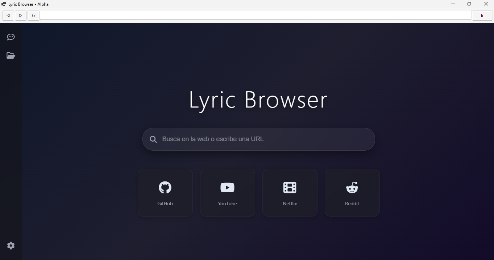

# Lyric Browser

Mini navegador basado en Chromium utilizando C# y CefSharp.

## Vista Previa

## Estado del Proyecto
- [x] Configuración de entorno .NET 8
- [x] Integración de motor Chromium
- [x] Creación de la Interfaz Base (UI)
- [x] Rediseño de Página de Inicio (Prototipo)